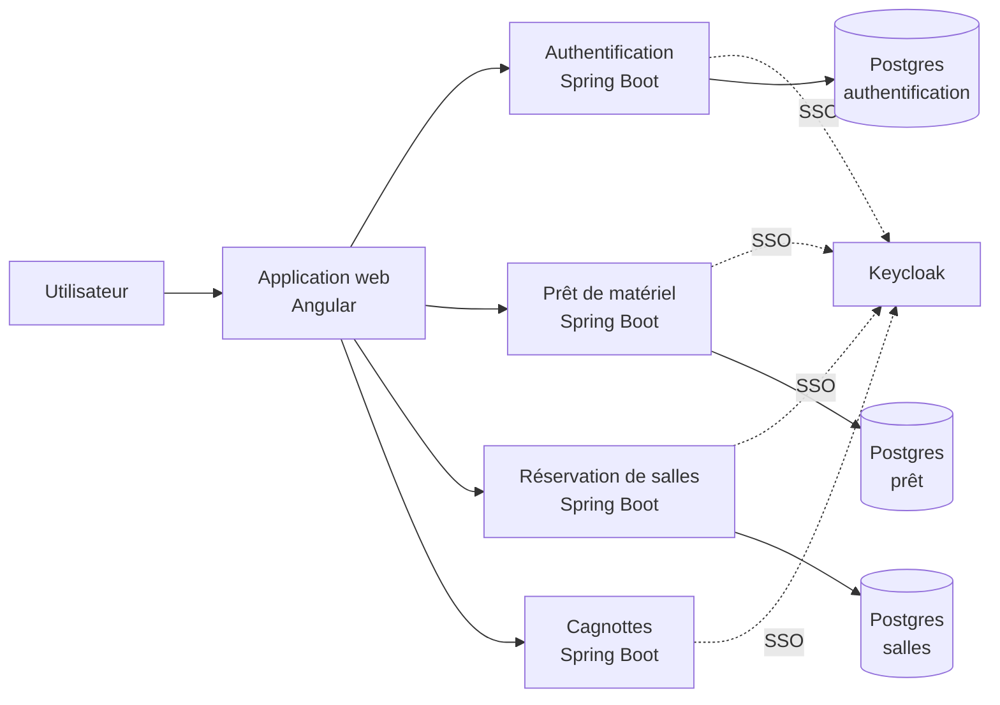

# craftkit44

**Un outil, plutôt que cinq : membres, prêt de matériel, réservation de salles, cagnottes cadeaux — pour n'importe quel petit groupe organisé.**

Projet personnel, développé sur mon temps libre.

---

## 🧩 Le principe

« Association » est à prendre au sens large : ça peut être une vraie association loi 1901,
mais tout aussi bien une bande de potes, une famille, une colloc, un club — n'importe quel
petit groupe qui a du monde, du matériel à faire tourner, un lieu à partager, ou une cagnotte
à organiser. Plutôt que jongler entre un tableur pour les membres, un groupe WhatsApp pour
savoir qui a la perceuse, un doodle pour la salle et une appli tierce pour la cagnotte,
l'idée de `craftkit44` est de couvrir tout ça avec un seul outil et un seul compte.

Techniquement, le projet est découpé en services indépendants derrière une authentification
unique, plutôt qu'un monolithe qui ferait tout et rien à la fois — mais côté utilisateur,
c'est une seule appli.

## 📦 Les repos

| Repo | Rôle | Stack | Statut |
|---|---|---|---|
| [`craftkit-authentification`](https://github.com/craftkit44/craftkit-authentification) | Comptes, associations, invitations | Spring Boot · Java 25 | 🟢 Actif |
| [`craftkit-frontend`](https://github.com/craftkit44/craftkit-frontend) | Application web | Angular 20 | 🟢 Actif |
| [`craftkit-lending`](https://github.com/craftkit44/craftkit-lending) | Prêt d'objets (perso + matériel commun d'association) | Spring Boot · Java 21 | 🟡 En cours |
| [`craftkit-RoomBooking`](https://github.com/craftkit44/craftkit-RoomBooking) | Réservation de salles | Spring Boot · Java 25 | 🟡 En cours |
| [`craftkit-giftly`](https://github.com/craftkit44/craftkit-giftly) | Cagnottes / listes cadeaux partagées | Spring Boot · Java 25 | 🔴 En pause |
| [`craftkit-common`](https://github.com/craftkit44/craftkit-common) | Code partagé entre les services | Java | 🟢 Actif |
| [`craftkit-deployment`](https://github.com/craftkit44/craftkit-deployment) | Outils de déploiement | — | 🟢 Actif |

🟢 en usage régulier · 🟡 fonctionnel mais pas fini · 🔴 arrêté temporairement

## 🏗️ Comment ça tient ensemble

Chaque service a sa propre base et ne référence les autres que par identifiant, jamais par un
accès direct à leurs données — pas de couplage fort entre eux.

## 🔧 Sous le capot

Backend Java/Spring Boot, frontend Angular, authentification unique via Keycloak (OIDC)
partagée entre tous les services.

## 📍 État du projet

C'est un projet perso, pas un produit commercial : certains services sont pleinement
fonctionnels et utilisés au quotidien, d'autres sont en chantier ou volontairement mis en
pause le temps de les reprendre.
